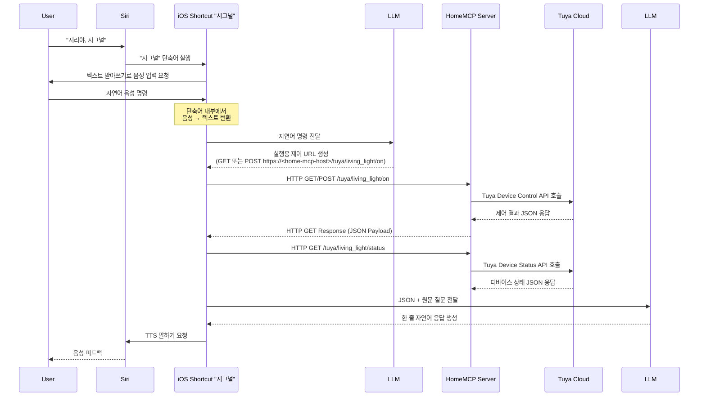

HomeMCP는 **Siri, Google Assistant 등 음성 기반 AI 어시스턴트를 통해 IoT 디바이스를 제어하기 위한 MCP(Multi Control Plane) 기반 스마트홈 오케스트레이션 시스템**입니다.

본 프로젝트는 **특정 벤더의 음성 플랫폼에 종속되지 않는 범용 음성 인터페이스 기반 IoT 제어 인프라를 설계·검증하는 것**을 목표로 하며,  
현재는 1차 단계로 **Siri와 Tuya 기반 IoT 디바이스를 연동한 구현**을 제공하고 있습니다.

---

## Key Features

- 음성 기반 AI 어시스턴트 연동형 IoT 제어 구조
- 2단계 LLM 처리 파이프라인
  - LLM #1: 자연어 음성 명령 → 실행 URL 생성
  - LLM #2: JSON 제어 결과 → 자연어 음성 응답 생성
- 개인 서버 기반 MCP(HomeMCP) 아키텍처
- Tuya Cloud 실 디바이스 제어 연동
- iOS Shortcuts 기반 자동화 파이프라인
- 음성 피드백(TTS) 기반 최종 사용자 응답
- 프리셋(Scene), 상태 조회, 자동화 확장 구조 지원
- 통합 GUI 기반 디바이스 · Scene · API 계정 관리 (계획)
- GET / POST 겸용 디바이스 제어 API 제공 (LLM / 브라우저 / 스크립트 공용)
- Tuya 외부 제어 대상(Windows Agent 등) 확장을 고려한 Action 매핑 구조

---

## System Overview

AI Assistant(Siri) → iOS Shortcuts → LLM #1 → HomeMCP 서버 → (Tuya Cloud | Windows Agent) → 실제 디바이스  
실제 디바이스 → (Tuya Cloud | Windows Agent) → HomeMCP 서버 → LLM #2 → iOS Shortcuts → AI Assistant(Siri)

---

## Repository Structure

본 프로젝트는 단일 Monorepo 구조로 구성되며, 각 서브 디렉터리는 HomeMCP 시스템의 개별 구성 요소를 담당합니다.

```bash
HomeMCP/
  README.md                         # Project overview (EN)
  README.ko.md                      # Project overview (KO)

  home-mcp-core/                    # Central MCP server (FastAPI)
    src/                            # Server implementation
    cli/                            # CLI for setup / operations
    pyproject.toml
    web/                            # Web panel (templates/static)

  home-mcp-siri-shortcuts-signal/   # Siri Shortcut (Signal) distribution & docs
    README.md
    README.ko.md
    install/                        # iCloud link + setup checklist (KO/EN)
    prompts/                        # Canonical prompts (LLM #1 / #2)
    shortcuts/                      # Signal.shortcut + example
    scripts/                        # Export / validation helpers

  home-mcp-llm-flows/               # Prompt orchestration (planned / WIP)
    # Schemas, generators, CLI/GUI (future)
```

---

## What is HomeMCP?

HomeMCP는 본 프로젝트 전체를 관통하는 **중앙 오케스트레이션 레이어**로,  
`home-mcp-core`, `home-mcp-siri-shortcuts-signal`, `home-mcp-llm-flows` 세 개의 주요 프로젝트를 유기적으로 연결합니다.

HomeMCP의 궁극적인 목표는 다음과 같습니다.

- 사용자는 단일 GUI 또는 CLI 환경에서
  - Tuya 계정 인증
  - 디바이스 자동 등록
  - 디바이스 별 호출 이름(alias) 지정
  - Scene(시나리오) 생성 및 관리
- 위 설정을 기반으로
  - `home-mcp-core` 서버 설정 파일 자동 생성
  - `home-mcp-llm-flows`에서 LLM 프롬프트 자동 생성
  - `home-mcp-siri-shortcuts-signal`에서 해당 프롬프트를 사용하는 단축어 링크 자동 생성

즉, HomeMCP는 **사용자 설정 → 서버 설정 → LLM 프롬프트 → 음성 단축어까지를 하나의 파이프라인으로 자동 구성하는 통합 오케스트레이션 시스템**을 지향합니다.

---

## End-to-End Control Flow


---

## Component Roles

| 구성 요소 | 역할 |
|-----------|------|
| User | 음성 명령 입력 |
| AI Assistant (Siri) | 음성 명령 트리거 |
| iOS Shortcuts | 음성 변환, LLM 호출, HTTP 요청, 음성 출력 |
| LLM #1 | 자연어 명령 → 제어 URL 생성 |
| HomeMCP 서버 | 개인 MCP 서버, Tuya API 중계 |
| Tuya Cloud | 실제 IoT 디바이스 제어 |
| LLM #2 | JSON → 자연어 응답 생성 |

---

## Supported Capabilities

- 디바이스 ON / OFF  
- 조명 밝기(brightness) 조절  
- 디바이스 상태 조회  
- 프리셋(Scene) 실행  
  - 무드 조명 모드  
  - 영화 감상 모드  
  - 취침 모드  
- Windows PC 제어 (화면 제어, 앱 실행 등 – Agent 기반)

## Control URL Specification (HomeMCP v1)

HomeMCP는 **URL 기반 제어 규칙**을 중심으로 음성 명령, LLM, 자동화를 연결합니다.
모든 제어는 HTTP **GET / POST** 요청으로 실행할 수 있으며,
이 URL 체계는 LLM #1이 자연어 명령을 실제 제어 요청으로 변환하는 기준 스펙으로 사용됩니다.

---

### 1) Single Action (단일 동작)

```
/tuya/{device}/{action}
```

Optional delay:

```
/tuya/{device}/{action}?delay={seconds}
```

Examples:
- 거실 불 켜기  
  `/tuya/living_light/on`
- 책상 불 10초 뒤 끄기  
  `/tuya/subdesk_light/off?delay=10`
- 디바이스 상태 조회  
  `/tuya/living_light/status`

---

### 2) Sequence (복수 동작 / 시퀀스)

여러 개의 동작을 하나의 요청으로 실행할 수 있습니다.

```
/tuya/sequence?actions=step1,step2,...
```

각 step 형식:

```
{device}:{action}[?delay=seconds]
```

- `delay`는 선택 사항이며, **현재 시점 기준 지연 실행**을 의미합니다.
- delay가 없는 step은 즉시 실행됩니다.
- step은 **URL에 작성된 순서를 그대로 유지하여 실행**됩니다.

Examples:

- 문 열고 거실 불 켜기
```
/tuya/sequence?actions=door:open,living_light:on
```

- 불을 켰다가 2시간 뒤 끄고, 컴퓨터는 1시간 뒤 끄기
```
/tuya/sequence?actions=living_light:on,living_light:off?delay=7200,pc:off?delay=3600
```

이 URL 구조는 음성 명령, 자동화 루틴, LLM 기반 해석 결과를
**하나의 공통 실행 포맷**으로 통합하기 위한 HomeMCP의 핵심 설계입니다.

---

## Planned Extensions

- 일정 · 날씨 · 위치 · 센서 조건 기반 자동화
- **멀티 IoT 플랫폼 지원**
  - Tuya 외 Cloud API 제공 IoT 플랫폼 연동
  - 벤더 종속성을 제거한 공통 Action 레이어
- **로컬 통신 기반 디바이스 제어** (Zigbee / Matter 등)
- Windows / macOS 에이전트 기반 로컬 시스템 제어
- 카메라 및 각종 센서 연동
- HomeKit 포함 다중 플랫폼 하이브리드 제어
- 모바일 웹 대시보드 및 통합 Web GUI
- Google Assistant 등 타 음성 플랫폼 확장

---

## System Automation Vision

HomeMCP는 단순한 서버 + 단축어 조합이 아니라,  
**사용자 설정을 중심으로 모든 구성 요소가 자동으로 생성·연동되는 시스템**을 목표로 합니다.

최종 목표 흐름은 다음과 같습니다.

1. 사용자가 HomeMCP GUI 또는 CLI에서 Tuya 계정을 연동
2. 디바이스 자동 스캔 및 등록
3. 각 디바이스 별 호출 이름(alias) 지정
4. 사용자 정의 Scene 생성
5. 위 설정을 기반으로
   - HomeMCP Core 설정 파일 자동 생성
   - LLM Control / Response 프롬프트 자동 생성
   - Siri Shortcut 링크 자동 생성

결과적으로 사용자는 **별도의 복잡한 설정 없이 음성 기반 스마트홈 제어 환경을 구성할 수 있는 구조**를 지향합니다.

---

## Project Objectives

본 프로젝트는 단순한 스마트홈 자동화 구현이 아니라,

- 음성 기반 AI 어시스턴트 중심의 IoT 제어 인프라 구조 설계
- MCP(Multi Control Plane) 서버 기반 개인 제어 시스템 구축
- LLM 기반 자연어 제어 및 응답 파이프라인 검증
- 특정 벤더에 종속되지 않는 확장형 음성 인터페이스 구조 실험

을 주요 목표로 합니다.

---

## Quick Start (초기 사용 방법)

> 아래 가이드는 **개발/테스트용 최소 셋업** 기준입니다. (배포/운영은 `Planned Extensions`의 Web GUI, 인증, 네트워크 보안 항목과 함께 별도 정리 예정)

### 0) 권장 환경

- **Python 3.11+ 권장** (표준 라이브러리 `tomllib` 사용)
  - 로컬 개발은 **3.12**를 권장합니다.
- macOS / Linux 권장

### 1) 레포 클론

```bash
git clone https://github.com/jaebinsim/HomeMCP
cd home-mcp
```

### 2) Python 가상환경 만들기

```bash
python3 -m venv .venv
source .venv/bin/activate
python -m pip install -U pip
```

### 3) 의존성 설치

HomeMCP는 Monorepo 구조이지만,  
**현재 Python 의존성은 `home-mcp-core/pyproject.toml`에서 단일 관리**됩니다.

초기 실행을 위해서는 `home-mcp-core`만 설치하면 됩니다.

```bash
cd home-mcp-core
pip install -e .
```

### 4) Tuya 연동 설정 (TOML)

디바이스 정의/계정 정보를 **TOML 설정 파일**로 관리합니다.

1) 예시 템플릿을 복사해서 내 설정 파일을 만듭니다.

```bash
cp home-mcp-core/config/settings.example.toml home-mcp-core/config/settings.toml
cp home-mcp-core/config/devices.example.toml home-mcp-core/config/devices.toml
```

### 5) 서버 실행 (home-mcp-core)

```bash
cd home-mcp-core
python -m uvicorn home_mcp_core.app:app --host 0.0.0.0 --port 8000 --reload
```

- `http://127.0.0.1:8000/panel/`
  - 기본 관리 페이지(Web Panel)입니다. 디바이스/설정 확인 및 테스트에 사용합니다.

#### 관리 페이지 미리보기 (Web Panel)

아래는 HomeMCP Core 서버에 포함된 기본 웹 관리 페이지 예시입니다.  
디바이스 등록 상태, 설정 파일 미리보기, 그리고 간단한 디버깅을 위해 사용됩니다.

**Overview (Dashboard)**


**Devices Management**


### 6) 기본 제어 테스트

```bash
# 단일 동작: 조명 ON
curl -X POST "http://localhost:8000/tuya/living_light/on"

# 단일 동작: 조명 OFF
curl -X POST "http://localhost:8000/tuya/living_light/off"

# 상태 조회
curl -X GET "http://localhost:8000/tuya/living_light/status"

# 시퀀스: 거실 불 켜고 5초 뒤 책상 불 끄기
curl -X GET "http://localhost:8000/tuya/sequence?actions=living_light:on,subdesk_light:off?delay=5"
```

### 7) Siri Shortcuts 연결 (home-mcp-siri-shortcuts-signal)

1) `home-mcp-siri-shortcuts-signal/install/setup-checklist.ko.md`를 따라 단축어를 설치
2) 단축어 내부의 HomeMCP 서버 주소를 내 서버 주소로 변경
3) 음성으로 호출

- “시리야, 시그널” → 받아쓰기 → “거실 불 켜줘”

> ⚠️ 현재 LLM 프롬프트/플로우 자동 생성 기능은 구조 설계 단계이며,
> 초기 버전에서는 개념 설명 위주로 제공됩니다. (CLI/GUI 기반 자동화는 추후 제공 예정)

### 8) LLM 프롬프트/플로우 설정 (home-mcp-llm-flows)

`home-mcp-llm-flows`는
- LLM #1: 자연어 → 실행 URL 생성
- LLM #2: JSON 결과 → 자연어 응답

을 위한 프롬프트/스키마를 관리합니다.

---

## Troubleshooting

- **Tuya 제어가 안 먹는 경우**
  - endpoint(리전) 확인, device_id 확인, 디바이스 capability 확인(밝기 지원 여부 등)
- **서버는 뜨는데 단축어에서 실패하는 경우**
  - iOS에서 로컬 네트워크 접근 권한/방화벽/포트포워딩/SSL 확인

---

## 📱 Siri Shortcuts (Signal) 문서 바로가기

HomeMCP의 음성 제어 진입점인 **Siri Shortcuts (Signal)** 과 관련된 문서들입니다.  
실제 음성 제어를 사용하려면 아래 문서들을 순서대로 참고하는 것을 권장합니다.

- 📄 **Signal 단축어 프로젝트 개요**
  - [home-mcp-siri-shortcuts-signal/README.ko.md](home-mcp-siri-shortcuts-signal/README.ko.md)

- 🔗 **iCloud 단축어 설치 링크**
  - [home-mcp-siri-shortcuts-signal/install/iCloud-link.ko.md](home-mcp-siri-shortcuts-signal/install/iCloud-link.ko.md)

- ✅ **단축어 설정 체크리스트 (필수)**
  - [home-mcp-siri-shortcuts-signal/install/setup-checklist.ko.md](home-mcp-siri-shortcuts-signal/install/setup-checklist.ko.md)

- 🧠 **LLM 프롬프트 가이드**
  - [home-mcp-siri-shortcuts-signal/prompts/README.ko.md](home-mcp-siri-shortcuts-signal/prompts/README.ko.md)

---