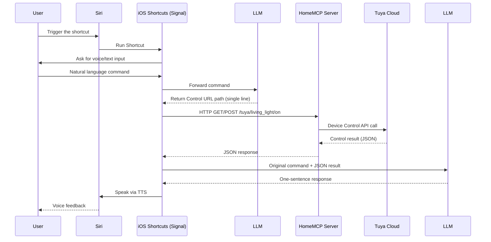
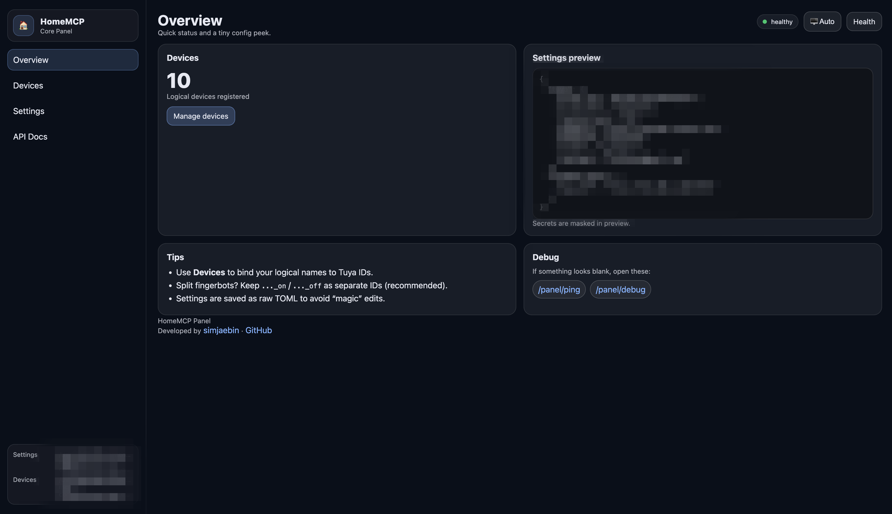
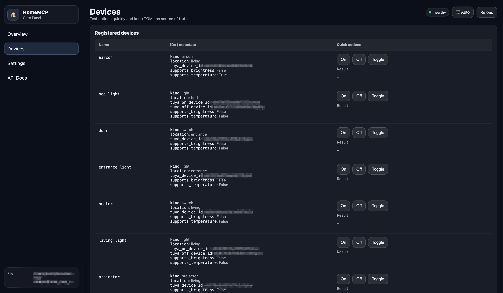

🇰🇷 [한국어 README 보기](README.ko.md)

# HomeMCP

HomeMCP is an **MCP (Multi Control Plane)-based smart home orchestration system** designed to control real IoT devices via **voice-first AI assistants** (e.g., Siri, Google Assistant).

The primary goal of this project is to **design and validate a universal voice-interface IoT control infrastructure that is not locked into a single voice ecosystem**.  
As a first milestone, the current implementation provides an integration of **Siri + Tuya-based IoT devices**.

---

## Key Features

- Voice-assistant-driven IoT control architecture
- Two-stage LLM processing pipeline
  - **LLM #1**: Natural language command → executable Control URL path
  - **LLM #2**: Control result JSON → natural language voice response
- Personal MCP (HomeMCP) server architecture (self-hosted)
- Real Tuya Cloud device control integration
- iOS Shortcuts-based automation pipeline
- Final user feedback via TTS
- Preset Scenes, status queries, and automation-ready structure
- Unified GUI for device / scene / API account management (planned)
- Unified **GET / POST** device control API (shared by LLM / browser / scripts)
- Action mapping layer designed for **Tuya + external controllers** (e.g., Windows Agent)

---

## System Overview

AI Assistant (Siri) → iOS Shortcuts → LLM #1 → HomeMCP Server → (Tuya Cloud | Windows Agent) → Physical Devices  
Physical Devices → (Tuya Cloud | Windows Agent) → HomeMCP Server → LLM #2 → iOS Shortcuts → AI Assistant (Siri)

---

## Repository Structure

This project is a **monorepo**, where each subdirectory represents a core component of the HomeMCP pipeline.

```bash
HomeMCP/
  README.md                         # Project overview (EN)
  README.ko.md                      # Project overview (KO)

  home-mcp-core/                    # Central MCP server (FastAPI)
    src/                            # Server implementation
    cli/                            # CLI for setup / operations
    pyproject.toml
    web/                            # Web panel (templates/static)

  home-mcp-siri-shortcuts-signal/   # Siri Shortcut (Signal) distribution & docs
    README.md
    README.ko.md
    install/                        # iCloud link + setup checklist (KO/EN)
    prompts/                        # Canonical prompts (LLM #1 / #2)
    shortcuts/                      # Signal.shortcut + example
    scripts/                        # Export / validation helpers

  home-mcp-llm-flows/               # Prompt orchestration (planned / WIP)
    # Schemas, generators, CLI/GUI (future)
```

---

## What is HomeMCP?

HomeMCP is the **central orchestration layer** that connects the major components:

- `home-mcp-core`
- `home-mcp-siri-shortcuts-signal`
- `home-mcp-llm-flows`

### Ultimate Vision

From a single GUI or CLI, users will be able to:

- Authenticate IoT accounts (Tuya and more)
- Auto-discover and register devices
- Assign human-friendly aliases
- Define custom Scenes

Based on this configuration, HomeMCP automatically generates:

- `home-mcp-core` server configuration
- LLM control & response prompts
- Siri Shortcut distribution links

In other words, HomeMCP aims to become:

> **A unified orchestration system that turns user configuration into server logic, LLM behavior, and voice shortcuts automatically.**

---

## End-to-End Control Flow



---

## Component Roles

| Component | Role |
|----------|------|
| User | Issues voice commands |
| AI Assistant (Siri) | Voice trigger |
| iOS Shortcuts | Speech-to-text, LLM calls, HTTP execution, TTS output |
| LLM #1 | Natural language → control URL path |
| HomeMCP Server | Personal MCP server + IoT gateway |
| Tuya Cloud | Real-world IoT device control |
| LLM #2 | Control JSON → natural language response |

---

## Supported Capabilities

- Device ON / OFF
- Light brightness control
- Device status queries
- Preset Scene execution
  - Mood lighting
  - Movie mode
  - Sleep mode
- Windows PC control (screen, application launch – agent-based)

---

## Control URL Specification (HomeMCP v1)

HomeMCP uses a **URL-based control scheme** that unifies voice commands, LLM output, and automation routines.  
All controls can be executed via HTTP **GET / POST**, and this specification is the contract used by **LLM #1**.

### 1) Single Action

```text
/tuya/{device}/{action}
```

Optional delay:

```text
/tuya/{device}/{action}?delay={seconds}
```

Examples:

- Turn on living room light  
  `/tuya/living_light/on`
- Turn off desk light after 10 seconds  
  `/tuya/subdesk_light/off?delay=10`
- Query device status  
  `/tuya/living_light/status`

### 2) Sequence (Multiple Actions)

Run multiple actions in a single request:

```text
/tuya/sequence?actions=step1,step2,...
```

Step format:

```text
{device}:{action}[?delay=seconds]
```

- `delay` is optional and represents a **relative delay from “now”**.
- Steps without `delay` run immediately.
- Steps execute **in the order they appear**.

Examples:

- Open door, then turn on living room light
```text
/tuya/sequence?actions=door:open,living_light:on
```

- Turn on light, turn it off after 2 hours, and turn off PC after 1 hour
```text
/tuya/sequence?actions=living_light:on,living_light:off?delay=7200,pc:off?delay=3600
```

This URL scheme is a core design of HomeMCP to standardize execution across voice, LLM, and automation.

---

## Planned Extensions

- Schedule / weather / location / sensor-driven automation
- **Multi IoT platform support**
  - Integrate other IoT platforms that provide Cloud APIs (beyond Tuya)
  - Vendor-agnostic common Action layer
- **Local protocol device control** (Zigbee / Matter, etc.)
- Windows / macOS agent-based local system control
- Camera and security sensor integration
- Hybrid control across multiple platforms (including HomeKit)
- Mobile web dashboard + unified Web GUI
- Google Assistant and other voice platforms

---

## Quick Start (Development / Local)

> This is a minimal setup for development/testing. Production hardening (auth, SSL, network security) will be documented separately.

### 0) Recommended Environment

- **Python 3.11+** (uses `tomllib`)
  - **3.12** is recommended for local development
- macOS / Linux recommended

### 1) Clone

```bash
git clone https://github.com/jaebinsim/HomeMCP
cd HomeMCP
```

### 2) Create a virtual environment

```bash
python3 -m venv .venv
source .venv/bin/activate
python -m pip install -U pip
```

### 3) Install dependencies

HomeMCP is a monorepo, but **Python dependencies are currently managed in `home-mcp-core/pyproject.toml`**.  
For the initial run, installing `home-mcp-core` is enough.

```bash
cd home-mcp-core
pip install -e .
```

### 4) Configure Tuya + devices (TOML)

```bash
cp home-mcp-core/config/settings.example.toml home-mcp-core/config/settings.toml
cp home-mcp-core/config/devices.example.toml home-mcp-core/config/devices.toml
```

### 5) Run the server

```bash
cd home-mcp-core
python -m uvicorn home_mcp_core.app:app --host 0.0.0.0 --port 8000 --reload
```

- `http://127.0.0.1:8000/panel/`  
  - Default Web Panel for checking devices/settings and running quick tests.

#### Web Panel Preview

Below is a preview of the default web management panel included in the HomeMCP Core server.  
It is used to inspect device registration status, preview configuration files, and perform basic debugging.

**Overview (Dashboard)**



**Devices Management**



### 6) Basic control tests

```bash
# Single action: Light ON
curl -X POST "http://localhost:8000/tuya/living_light/on"

# Single action: Light OFF
curl -X POST "http://localhost:8000/tuya/living_light/off"

# Status query
curl -X GET "http://localhost:8000/tuya/living_light/status"

# Sequence: turn on living light, then turn off desk light after 5 seconds
curl -X GET "http://localhost:8000/tuya/sequence?actions=living_light:on,subdesk_light:off?delay=5"
```

### 7) Connect Siri Shortcuts

Follow the setup guide:

- `home-mcp-siri-shortcuts-signal/install/setup-checklist.md`

---

## Troubleshooting

- **Tuya control not working**
  - Verify endpoint (region), device IDs, and device capabilities (e.g., brightness support).
- **Server works but iOS Shortcut fails**
  - Check local network permissions, firewall/port-forwarding, and SSL configuration.

---

## 📱 Siri Shortcuts (Signal) – Related Documentation

The documents below explain how these prompts are actually used inside the
**HomeMCP Signal iOS Shortcut**, from installation to full configuration.

If you are setting up voice control for the first time, it is recommended
to read them in order.

- 📄 **Signal Shortcut Overview**
  - [home-mcp-siri-shortcuts-signal/README.md](home-mcp-siri-shortcuts-signal/README.md)

- 🔗 **Install Signal Shortcut (iCloud Link)**
  - [home-mcp-siri-shortcuts-signal/install/iCloud-link.md](home-mcp-siri-shortcuts-signal/install/iCloud-link.md)

- ✅ **Signal Setup Checklist**
  - [home-mcp-siri-shortcuts-signal/install/setup-checklist.md](home-mcp-siri-shortcuts-signal/install/setup-checklist.md)

- 🧠 **LLM Prompt Usage Guide**
  - [home-mcp-siri-shortcuts-signal/prompts/README.md](home-mcp-siri-shortcuts-signal/prompts/README.md)

---